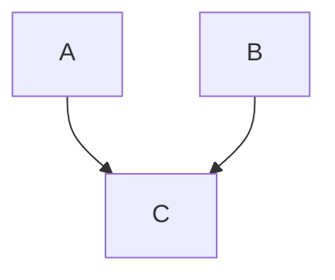
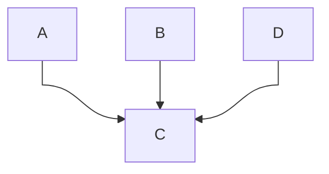
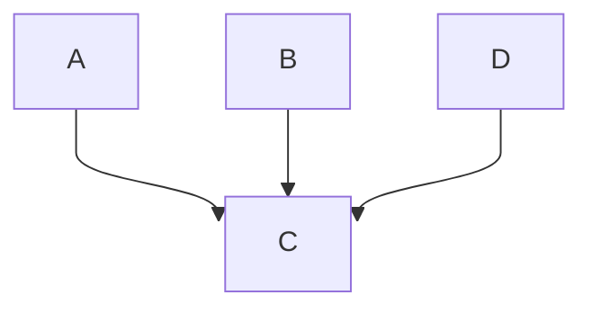
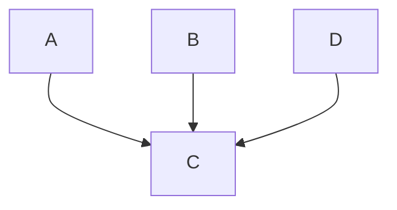
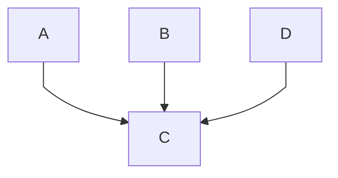
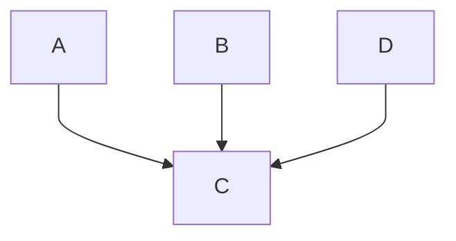
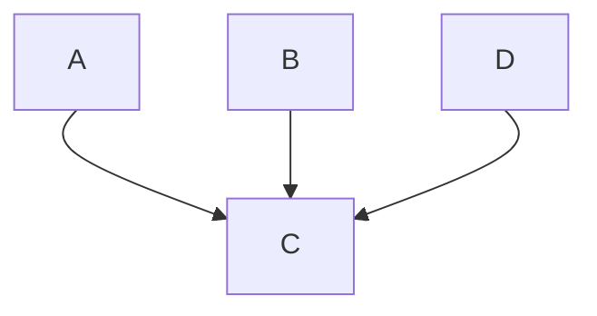
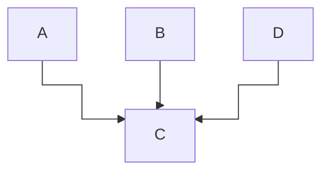
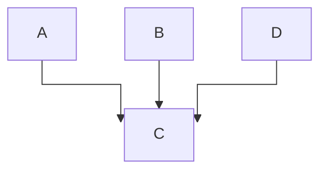
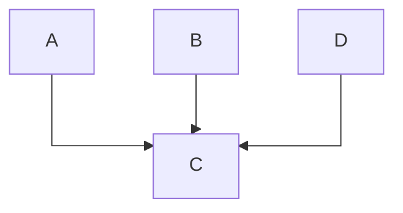

```mermaid
%%{init: {"flowchart": {"curve": "linear"}}}%%
flowchart TD
    A --> C
    B --> C
```

```mermaid
%%{init: {"flowchart": {"curve": "basis"}}}%%
flowchart TD
    A --> C
    B --> C
```

```mermaid
%%{init: {"flowchart": {"curve": "bumpX"}}}%%
flowchart TD
    A --> C
    B --> C
    D --> C
```

```mermaid
%%{init: {"flowchart": {"curve": "bumpY"}}}%%
flowchart TD
    A --> C
    B --> C
    D --> C
```

```mermaid
%%{init: {"flowchart": {"curve": "cardinal"}}}%%
flowchart TD
    A --> C
    B --> C
    D --> C
```

```mermaid
%%{init: {"flowchart": {"curve": "catmullRom"}}}%%
flowchart TD
    A --> C
    B --> C
    D --> C
```

```mermaid
%%{init: {"flowchart": {"curve": "monotoneX"}}}%%
flowchart TD
    A --> C
    B --> C
    D --> C
```

```mermaid
%%{init: {"flowchart": {"curve": "monotoneY"}}}%%
flowchart TD
    A --> C
    B --> C
    D --> C
```

```mermaid
%%{init: {"flowchart": {"curve": "natural"}}}%%
flowchart TD
    A --> C
    B --> C
    D --> C
```

```mermaid
%%{init: {"flowchart": {"curve": "step"}}}%%
flowchart TD
    A --> C
    B --> C
    D --> C
```

```mermaid
%%{init: {"flowchart": {"curve": "stepAfter"}}}%%
flowchart TD
    A --> C
    B --> C
    D --> C
```

```mermaid
%%{init: {"flowchart": {"curve": "stepBefore"}}}%%
flowchart TD
    A --> C
    B --> C
    D --> C
```